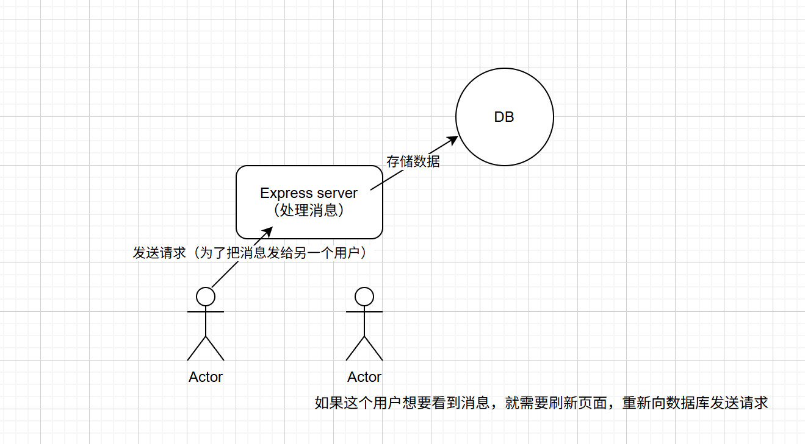
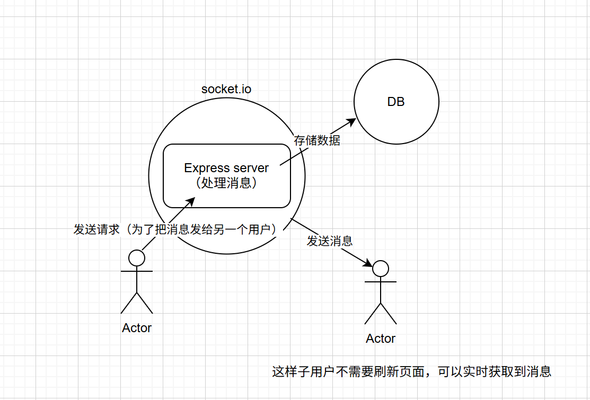

## 📦 依赖包说明

| 包名            | 用途简介                                             |
| --------------- | ---------------------------------------------------- |
| `express`       | Node.js 最流行的 Web 框架，用于构建后端接口或网站    |
| `dotenv`        | 用于加载 `.env` 文件中的环境变量                     |
| `cookie-parser` | 用于解析请求中的 Cookie，方便读写 Cookie             |
| `bcryptjs`      | 用于加密和验证密码（Hash），保障用户密码安全         |
| `mongoose`      | MongoDB 的 ODM 工具，用于连接和操作 MongoDB 数据库   |
| `socket.io`     | 实现实时通信（WebSocket），常用于聊天、游戏等        |
| `jsonwebtoken`  | 用于生成和验证 JWT 令牌，常用于用户身份认证（Token） |

## 当 JWT_SECRET 想不到时

可以使用以下命令生成一个新的 JWT 密钥：

```bash
openssl rand -base64 32
```

意思是 生成一个 32 字节的随机字符串，并将其编码为 Base64 格式。

## 数据库架构图

### 对话和消息 的结构

```
    Conversation {
        _id  "对话唯一标识符" （MongoDB 自动生成）
        particpants "参与者数组"
        messages "消息数组"
    }

    Message {
         _id  "消息唯一标识符" （MongoDB 自动生成）
        message "消息内容"
        receiverId "接收者用户 ID"
        senderId "发送者用户 ID"
    }
```

## 为什么要用 Socket.io

### 没用 socket.io 之前



### 用 socket.io 之后


